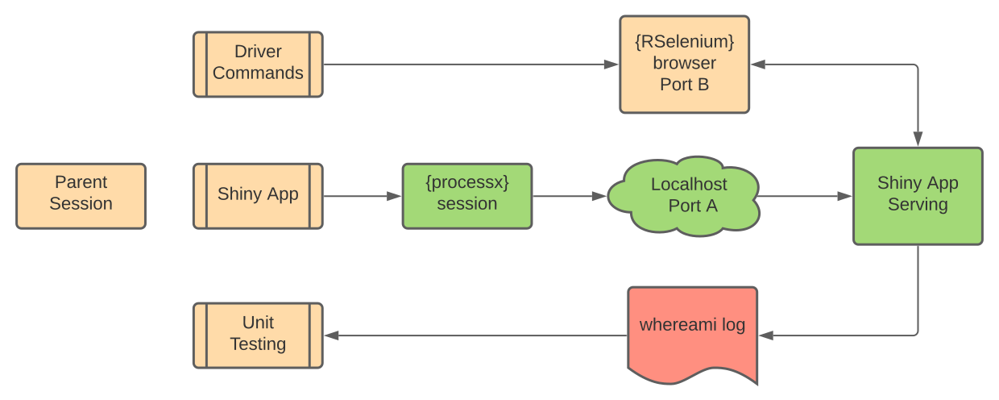

```{r setup, include=FALSE}
options(htmltools.dir.version = FALSE)
```

```{r xaringan-themer, include=FALSE, warning=FALSE}
library(xaringanthemer)
style_mono_light(base_color = "#23395b")
```

# Motivation

.pull-left[
The ability to **diagnose** and **resolve** cascading reactivity in Shiny applications is an integral part of good application development preventing a waste of resources and negative user experiences.
]

.pull-right[

]


---

# Unit Testing

  - Unit testing creates a framework that improves collaboration across multiple developers, enables coverage tracking across varying scenarios and promotes a safer production environment. 

  - This is commonly used in R package development to validate source code. 
  
  - In Shiny applications the ability to diagnose and resolve reactivity problems through unit testing is lacking.

---

# Solution

- The __reactor__ package solves this issue by creating a new framework that adds reactivity expectations to unit testing in R.

- With __reactor__ defensive development can by applied to Shiny applications to both plan and preserve reactivity with multiple developers working on the application in a production environment.

## Where it's at

GitHub: https://github.com/yonicd/reactor

```{r,eval = FALSE}
remotes::install_github('yonicd/reactor')
```

---

# Reactor Testing Workflow

The __{reactor}__ workflow is split into three sequential steps

1. Serving a Shiny application nested with __{whereami}__ calls via __{processx}__.
1. "Drive" the active Shiny application with pre-specified commands using headless browsing via __{Rselenium}__. As the application is reacting to the commands __{whereami}__ logs the reactivity events. 
1. Once the prespecified commands have completed the __{whereami}__ log file is used by expectations of reactivity in a __{testthat}__ environment.

---

# Reactor Testing Workflow



---

# Shiny App

The rest of the slides explain how __{reactor}__ workflow is used through a simple Shiny app. 

The app will have two UI elements:

  - A numeric input (`input$n`) that the user can change.
  - A plot output showing the `histogram(runif(input$n))` which observes changes to `input$n`

On the server side we will add a new element for logging reactivity using a package called __{whereami}__.

---

```{r,eval = FALSE}
# Global Variables
n <- 200

# Define the UI
ui <- shiny::bootstrapPage(
  shiny::numericInput('n', 'Number of obs', n),
  shiny::plotOutput('plot')
)

# Define the server code
server <- function(input, output) {

  shiny::observe({
    output$plot <- shiny::renderPlot({
      whereami::whereami(tag = 'hist') #<<
      graphics::hist(stats::runif(input$n))
    })
  })
}

# Return a Shiny app object
shiny::shinyApp(ui = ui, server = server)

```

---

# whereami 
__{whereami}__ is a package that logs the locations where command in an R session were invoked and their source location.

Using __{whereami}__ with shiny is simple. 

In the app place `cat_where(whereami())` on the server side and every time the rendering application hits the line it will print to console indicating which line has been hit accompanied by a counter.

```r
── Running renderPlot(...) at shiny.R#15 (1) ───────────────────────────────────────────
── Running renderPlot(...) at shiny.R#15 (2) ───────────────────────────────────────────
```

Running the example app will trigger the command at `line 15` twice on app initialization. The lines above will be printed to the console as the app runs and a json log file will be updated automatically.

---
## Shiny whereami example

---

# Running our App

Now that we have an app with a __{whereami}__ call in the server script we need to run it in a child R process. 

To do this we use __{processx}__ and use a `localhost` port by default.

```{r,echo = FALSE}
details::details(reactor::runApp_args(
  test_path = 'tests/path',
  appDir = 'app/path'),
  summary = 'Commands passed to child prcess')
```

--

.pull-left[
Don't worry! __{reactor}__ takes care of this machinery for you.
]

.pull-right[

]


---

# Communicating with the App

To interact with the application that is running in the child process reactor depends on __{RSelenium}__.

.pull-left[

When the __{RSelenium}__ is invoked it opens _another_ child process and port on the `localhost` to run the webdriver. 

__{RSelenium}__ uses webdrivers to manipulate content on a web browser. __{reactor}__ comes with functions to set up the proper arguments and preferences to use webdrivers for `firefox` and `chrome`. 

]

.pull-right[
```{r,echo = FALSE}
details::details(reactor::firefox_options(),summary = 'Firefox Preferences',
                 open = TRUE)
```

]

---

# Interacting with the App
.pull-left[
Now we have two active child processes at the same time and the webdriver can manipulate the running shiny app!

We use __{RSelenium}__ commands and built in __{reactor}__ functions that simplify asynchronous pipelines.
]

.pull-right[

]

---

# {reactor} asynchronous pipelines

  - __wait__ will run the expression only shiny is not busy and the element exists.
  - __then__ will run after __wait__ is evaluated.
  
In this example we are __waiting__ for shiny to finish invalidating elements and find the plot associated with `outpu$plot` and saves it in the object `elem`. Once `elem` is assigned __then__ we use it to retrieve src attribute. 

```{r,eval = FALSE}
hist_src <- test_driver%>%
    reactor::wait(
      expr = test_driver$client$findElement(
        using = 'css', 
        value = '#plot > img')
    )%>%
    reactor::then(
      expr = function(elem) {
        elem$getElementAttribute('src')[[1]]
      },
      test_driver = test_driver
    )
```

---

We change the value of `input$n` and increase it by 4

```{r,eval = FALSE}
test_driver$client$executeScript(
  script = 'arguments[0].stepUp(4);',args = list(el_n)
  )
```

Now we can compare the new img src attribute with `hist_src`. We use `then2` to pass 2 elements and use `is_identical` to ask the question is the old src and the new src the same?

```{r,eval = FALSE}
test_driver%>%
  reactor::wait(
    expr   = test_driver$client$findElement(
      using = 'css', value = '#plot > img'
      )
)%>%
reactor::then2(
  elem2 = hist_src,
  expr   = function(elem,elem2){
    elem$getElementAttribute('src')[[1]]%>%is_identical(elem2)
  },
  test_driver = test_driver
)
```

---
# Test Reactor

`test_reactor` ties all these concepts together. 

```{r, eval = FALSE}
hist_counter <- reactor::test_reactor(
  expr          = driver_commands,
  test_driver   = reactor::firefox_driver(),
  processx_args = reactor::runApp_args(appDir = 'PATH_TO_APP')
)
```

- __driver_commands__ contains the expressions to pass to the webdriver.
- __test_driver__ contains the RSelenium Driver.
- __processx_args__ contains the expressions to pass to the child process that will host the 
---

# Back to whereami

As you are driving the app with __{RSelenium}__ there is a log file being updated by __{whereami}__ keeping a counter each time it is triggered. 

This is the important piece that we will use to connect all this to our unit testing expectations.

.pull-left[
- The following is an example of what the outputs stored looks like. 
- Line 15 of the Shiny app was triggered twice consecutively.
]

.pull-right[
|tag   |where         |when                 |  count|
|:----:|:------------:|:-------------------:|:-----:|
|hist  |app.R#15      |2020-09-27 10:19:59  |      1|
|hist  |app.R#15      |2020-09-27 10:19:59  |      2|
]

--

<br>

<warn-blockquote>Was this the intended action we wanted when developing the app?</warn-blockquote>

---
# Unit Testing (Expectations)

__{reactor}__ comes with its own set of expectations that are built for __{whereami}__ outputs and can be used inside __{testthat}__.

Using the __{whereami}__ log output structure we indicate the `tag` we want to use (`'hist'`) and the expected counter value (`1`).

```{r,eval = FALSE}
it('reactive hits in plot reactive chunk',{
  reactor::expect_reactivity(
    object = hist_counter, tag = 'hist',count =  1
  )
})
```

If is is FALSE the following error message is returned

```{r,eval = FALSE}
Error: The tag 'hist' has reactivity count of 2, not 1.
```

---

# Fixing our App
<warn-blockquote> __Bad App__ `renderPlot` is in an `observe` which is triggered every time the app is invalidated </warn-blockquote>
```{r,eval = FALSE}
shiny::observe({ #<<
  output$plot <- shiny::renderPlot({
    whereami::whereami(tag = 'hist')
    hist(stats::runif(input$n))})
  })
```

<ok-blockquote> __Good App__ `renderPlot` is in an `observeEvent` which is triggered only when `input$n` is invalidated. </ok-blockquote>

```{r,eval = FALSE}
shiny::observeEvent(input$n,{ #<<
  output$plot <- shiny::renderPlot({
    whereami::whereami(tag = 'hist')
    hist(stats::runif(input$n))})
  })
```


---

# Unit Testing

  - The testing file for __{reactor}__ is set up exactly the same as a __{testthat}__ file, except that instead of using the naming convention `test-*.R` you can use `reactor-*.R`. 

```r
tests
├── testthat
│   ├── reactor-reactivity.R # Reactive Tests
│   └── test-loads.R # Package tests
└── testthat.R
```

  - This serves the purpose of making it simpler to isolate reactivity tests from the other tests that may be in a package.
  
  - Reactivity tests can be called directly by using `reactor::test_app()`

---

# Unit Tesing Reactivity 
<br>


---

# Go forth and test your apps!

.pull-left[
What __{reactor}__ gives you:

- Simplifies diagnosing reactivity issues in Shiny
- Creates framework to store and reproduce testing of Shiny Apps
- Can be applied in Continuous Integration environments
- Creates safer Shiny app development practices for teams to collaborate.
]

.pull-right[

]

## Thank you :)


