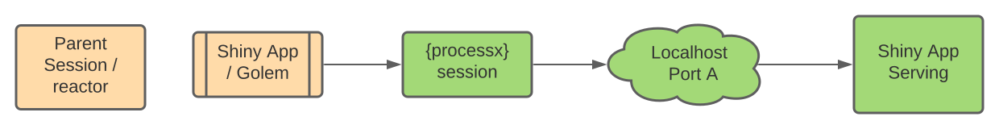

```{r setup, include=FALSE}
options(htmltools.dir.version = FALSE)
```

```{r xaringan-themer, include=FALSE, warning=FALSE}
library(xaringanthemer)
style_mono_light(base_color = "#23395b")
xaringanExtra::use_panelset()
```

```{r share-again, echo=FALSE, eval = FALSE}
xaringanExtra::use_clipboard()
xaringanExtra::use_share_again()
```

# Motivation

.pull-left[
The ability to **diagnose** and **resolve** cascading reactivity in Shiny applications is an integral part of good application development preventing a waste of resources and negative user experiences.

__Cascading Reactivity__: Elements in a shiny app trigger each other in a manner the developer did not intend.
]

.pull-right[

]


---

# Unit Testing

  - Unit testing creates a framework that improves collaboration across multiple developers, enables coverage tracking across varying scenarios and promotes a safer production environment. 

  - This is commonly used in R package development to validate source code. 
  
  - In Shiny applications the ability to __diagnose and resolve reactivity problems through unit testing is lacking__.

---
# Solution 

- The __{reactor}__ package solves this issue by creating a new framework that adds reactivity expectations to unit testing in R.

- With __{reactor}__ defensive development can by applied to Shiny applications to both plan and preserve reactivity with multiple developers working on the application in a production environment.

## Where it's at

GitHub: https://github.com/yonicd/reactor

```{r,eval = FALSE}
remotes::install_github('yonicd/reactor')
```

---
### How does {reactor} fit in with other packages?

Currently there are not a lot of packages that deal with unit testing and specifically testing reactivity in Shiny applications.

.pull-left[
__{shinyjster}__

JavaScript testing on Shiny applications

__{shinytest}__ 

Checks Inputs and UI behavior.
- Integrates with __{testthat}__
- Integrates with Continuous Integration
]

.pull-right[
__{shiny}::testServer__

Built-in testing script for __{shiny}__ that works with shiny modules to create testing environment to verify reactive outputs are as expected.
]

<message-blockquote>These packages work well for testing that reactivity has occurred and that the output is as expected, but they do not test if the reactivity is creating problems with the app integrity and the second order effects such as repetitive or cascading reactivity.</message-blockquote>

---

# Reactor Object

Reactor is a pipeline driven workflow. To begin we create a reactor class object

```r
library(reactor)
```

```r
obj <- init_reactor()
obj
#> reactor:
#>   application: ~
#>   driver: ~
```

You can see it is expecting to be populated by two objects 

  - __application__: Specifications for the background process that will host the application
  - __driver__: Specifications for the webdriver that will interact with the application in the background process
  
---
# Application

Reactor can host either a 

#### Standard Shiny App

```r
obj <- obj%>%
     set_runapp_args(
         appDir = 'PATH_TO_APP/app.R'
     )
# Adding runApp Settings
```

#### Golem App

```r
obj <- obj%>%
  set_golem_args(package_name = 'mypackage')
# Adding runApp Settings
```

---
## Application <a class="reactor-link" data-lightbox="reactor" data-title="Reactor Workflow" href="media/reactor_01_a.svg"> </a>

What's going on under the hood?

Reactor is setting up the necessary definitions for serving a Shiny application calls via __{processx}__.

```yml
reactor:
  application:
    runApp:
      test_port: 27612
      test_path: /var/folders/kx/t4h_mm1910sb7vhm_gnfnx2c0000gn/T//RtmpW8xetO
      test_ip: 127.0.0.1
      test_trace: no
      appDir: PATH_TO_APP/app.R
  driver: ~
```

---
### Driver <a class="reactor-link" data-lightbox="reactor" data-title="Reactor Workflow" href="media/reactor_02_c.svg"> </a>

Next we will choose which `Web Driver` we want to use:

__Chrome__

```r
obj <- obj %>% set_chrome_driver()
# Adding chrome Settings
```

__Firefox__

```r
obj <- obj %>% set_firefox_driver()
# Replacing chrome with firefox Settings
```

__Turn Headless Mode Off__

```r
obj <- obj %>%
  set_firefox_driver(
    opts = firefox_options(headless = TRUE)
  )
# Updating firefox Settings
```

---
### Starting Reactor

Once we have specifications in place we can start reactor using `start_reactor()`. 

```r
obj %>% start_reactor()
```
.pull-left[
Now we have two active child processes at the same time and the webdriver can manipulate the running shiny app!

We use __{RSelenium}__ commands and built in __{reactor}__ functions that simplify asynchronous pipelines.
]

.pull-right[

]

<details><summary>Side Note</summary>
<ok-blockquote>
{reactor} works with {crrri} or {crrry} much the same way it works with {RSelenium}. More info in the package GitHub repository.
</ok-blockquote>
</details>
<br>

---

## Interacting with the Application

Reactor comes with prebuilt common actions that lower the threshold to interact with the application

.panelset[
.panel[.panel-name[Injecting]
- Inputs
  - `set_id_value()`: Sets a value for a shiny input object by id
- JavaScript
  - `execute()`: Executes a JavaScript call
]
.panel[.panel-name[Querying]
- Inputs 
  - `query_input_names()`: Returns names of the shiny input ids
  - `query_input_id()`: Returns current values of a shiny input by id
- Outputs
  - `query_output_names()`: Returns names of the shiny output ids
  - `query_output_id()`: Returns current values of a shiny output by id
- JavaScript
  - `query()`: Returns a value from JavaScript call
]
]

---
## Closing Reactor

Closing reactor is simple

.pull-left[

```r
obj %>% 
  kill_app()
```

This will 
- Close both child processes that reactor is using
- Clean up the temporary directory from side-effects.

]
.pull-right[

]

---

# Shiny App

The rest of the slides explain how __{reactor}__ workflow is used through a simple Shiny app. 

The app will have two UI elements:

  - A numeric input (`input$n`) that the user can change.
  - A plot output showing the `histogram(runif(input$n))` which observes changes to `input$n`

On the server side we will add a new element for logging reactivity using __{whereami}__.

---
```{r,eval = FALSE}
# Global Variables
n <- 200
# Define the UI
ui <- shiny::bootstrapPage(
  shiny::uiOutput('n'),
  shiny::plotOutput('plot')
)
# Define the server code
server <- function(input, output) {
  output$n <- renderUI({
    shiny::numericInput('n', 'Number of obs', n)
  })
  
  output$plot <- shiny::renderPlot({
    whereami::whereami(tag = 'hist') #<<
    graphics::hist(stats::runif(input$n))
  })
}
# Return a Shiny app object
shiny::shinyApp(ui = ui, server = server)
```

--

<warn-blockquote> What does `whereami::whereami(tag = 'hist')` do? </warn-blockquote>


---

# whereami 
__{whereami}__ is a package that logs the locations where command in an R session were invoked and their source location.

Using __{whereami}__ with shiny is simple. 

In the app file place __cat_where(whereami(tag = 'hist'))__ on the server side.

Every time the rendering application hits the line it will print to console indicating which line has been hit accompanied by a counter.

```r
── Running renderPlot(...) at shiny.R#15 (1) ─────────────────
── Running renderPlot(...) at shiny.R#15 (2) ─────────────────
```

Using the __tag__ argument will log the counter to a specific internal label and allow multiple concurrent counters.

---
## Shiny whereami example
.center[]

<message-blockquote> Save the code to file to run the example </message-blockquote>
---

# Constructing Pipelines

Because each function is returning the reactor object it is simple to create reactor pipelines.

Reactor will wait for shiny to finish each action before proceeding to the next one.

```r
init_reactor() %>%
  set_runapp_args(
    appDir = system.file('examples/good_app.R',package = 'reactor')
  ) %>%
  set_chrome_driver() %>%
  start_reactor() %>%
  set_id_value('n',500) %>%
  set_id_value('n',300) %>%
  kill_app()
```

---

# Testing Expectations <a class="reactor-link" data-lightbox="reactor" data-title="Reactor Workflow" href="media/reactor_03_b.svg"> </a>

Testing expectations is done as a natural extension of the pipeline. 

.panelset[
.panel[.panel-name[Reactivity]

```{r,eval = FALSE}
init_reactor() %>%
  set_runapp_args(
    appDir = system.file('examples/good_app.R',package = 'reactor')
  ) %>%
  set_chrome_driver() %>%
  start_reactor() %>%
  set_id_value('n',500) %>%
  expect_reactivity('hist',1) %>%  #<<
  set_id_value('n',200) %>%
  expect_reactivity('hist',2) %>% #<<
  kill_app()
```
]
.panel[.panel-name[Busy Time]

Test expectations for how long shiny is busy for a single interaction event or the cumulative busy time. 

```{r,eval = FALSE}
init_reactor() %>%
  set_runapp_args(
    appDir = system.file('examples/good_app.R',package = 'reactor')
  ) %>%
  set_chrome_driver() %>%
  start_reactor() %>%
  set_id_value('n',500) %>%
  expect_busy_time(0.1) %>% #<<
  expect_reactivity('hist',1) %>%
  kill_app()
```

]
]

---

### Fixing our App
<warn-blockquote> __Bad App__ `renderPlot` is triggered twice when the app is initially invalidated, as elements are generated in the app. </warn-blockquote>
```{r,eval = FALSE}
output$plot <- shiny::renderPlot({
  whereami::whereami(tag = 'hist')
  hist(stats::runif(input$n))
})
```

<ok-blockquote> __Good App__ `req` is in the `renderPlot` which is triggered only when `input$n` exists and is invalidated. </ok-blockquote>

```{r,eval = FALSE}
output$plot <- shiny::renderPlot({
  shiny::req(input$n) #<<
  whereami::whereami(tag = 'hist')
  hist(stats::runif(input$n))
})
```

---

# Testthat Integration

```r
testthat::context("testing reactivity with reactor")

obj <- init_reactor() %>%
  set_firefox_driver() %>%
  set_runapp_args( appDir = system.file( 'examples/good_app.R', package = 'reactor') )

testthat::describe('good reactive',{

  it('reactive hits in plot reactive chunk',{
    obj %>%
      start_reactor() %>%
      set_id_value('n',500) %>%
      expect_reactivity(tag = 'hist',count =  2) %>%
      kill_app()
  })
  
  it('another expectation',{
    obj %>%
      start_reactor() %>%
      ... %>%
      kill_app()
  })
  
})
```

---

# Directory Structure

  - The testing file for __{reactor}__ is set up exactly the same as a __{testthat}__ file, except that instead of using the naming convention `test-*.R` you can use `reactor-*.R`. 

```r
tests
├── testthat
│   ├── reactor-reactivity.R # Reactive Tests
│   └── test-loads.R # Package tests
└── testthat.R
```

  - This serves the purpose of making it simpler to isolate reactivity tests from the other tests that may be in a package.
  - Will not interact with `covr`
  - Reactivity tests can be called directly by using `reactor::test_app()`

---

# Unit Testing Reactivity 

.center[<a class="reactor05-link" data-lightbox="reactor05" data-title="Testthat Console" href="https://github.com/yonicd/reactor/raw/media/example_api.gif"> </a>]

---

# Continuous Integration

.pull-left[

{reactor} can also be utilized with version control and continuous integration to improve the stability of shiny app development with many collaborators. 

An example workflow for github actions which comes with `googledriver` and `geckodriver` pre-installed can be found [here](https://github.com/yonicd/reactor/blob/master/.github/workflows/R-reactor.yml).
]
.pull-right[
 <a class="reactor06-link" data-lightbox="reactor06" data-title="Continuous Integration" href="media/gha_2.png"> </a>
]

---


# Go forth and test your apps!

.pull-left[
What __{reactor}__ gives you:

- Simplifies diagnosing reactivity issues in Shiny
- Creates framework to store and reproduce testing of Shiny Apps
- Can be applied in Continuous Integration environments
- Creates safer Shiny app development practices for teams to collaborate.
]

.pull-right[
<br/>
<br/>

]
<br/>
### .center[Thank you :)]


