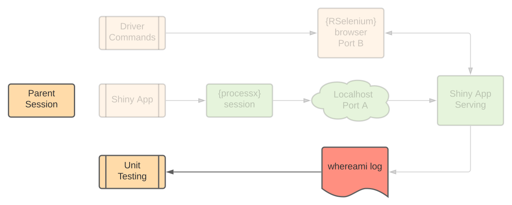
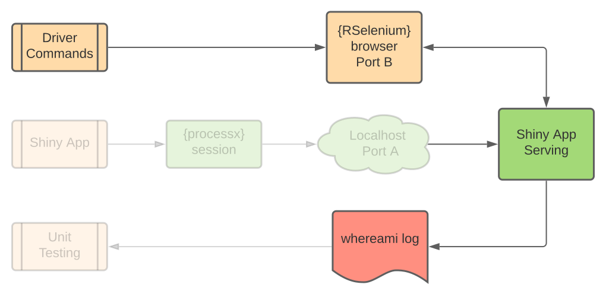

```{r setup, include=FALSE}
options(htmltools.dir.version = FALSE)
```

```{css, echo=FALSE}
pre {
  background: #FFBB33;
  max-width: 100%;
  max-height: 350px;
  overflow-x: auto;
  overflow-y: auto;
  white-space: pre-wrap;
  white-space: -moz-pre-wrap;
  white-space: -pre-wrap;
  white-space: -o-pre-wrap;
  word-wrap: break-word;
}
```

```{r xaringan-themer, include=FALSE, warning=FALSE}
library(xaringanthemer)
style_mono_light(base_color = "#23395b")
```

```{r share-again, echo=FALSE}
xaringanExtra::use_clipboard()
xaringanExtra::use_share_again()
```

# Motivation

.pull-left[
The ability to **diagnose** and **resolve** cascading reactivity in Shiny applications is an integral part of good application development preventing a waste of resources and negative user experiences.
]

.pull-right[

]


---

# Unit Testing

  - Unit testing creates a framework that improves collaboration across multiple developers, enables coverage tracking across varying scenarios and promotes a safer production environment. 

  - This is commonly used in R package development to validate source code. 
  
  - In Shiny applications the ability to __diagnose and resolve reactivity problems through unit testing is lacking__.

---
# Solution 

- The __{reactor}__ package solves this issue by creating a new framework that adds reactivity expectations to unit testing in R.

- With __{reactor}__ defensive development can by applied to Shiny applications to both plan and preserve reactivity with multiple developers working on the application in a production environment.

## Where it's at

GitHub: https://github.com/yonicd/reactor

```{r,eval = FALSE}
remotes::install_github('yonicd/reactor')
```

---
### How does {reactor} fit in with other packages?

Currently there are not a lot of packages that deal with unit testing and specifically testing reactivity in Shiny applications. The two primary methods are:

.pull-left[
__{shinytest}__ 
- Checks that inputs change properly and that UI behaves consistently.
- Integrates with __{testthat}__
- Integrates with Continous Integration
]

.pull-right[
__{shiny}::testServer__

Built in testing script for __{shiny}__ that works with shiny modules to create testing environment to verify reactive outputs are as expected.
]

<message-blockquote>These packages work well for testing that reactivity has occurred and that the output is as expected, but they do not test if the reactivity is creating problems with the app integrity and the second order effects such as repetitive or cascading reactivity.</message-blockquote>

---

# Reactor Testing Workflow

The __{reactor}__ workflow is split into three parts

1. Serving a Shiny application nested with __{whereami}__ calls via __{processx}__.


---
# Reactor Testing Workflow

2\. "Drive" the Shiny application with pre-specified commands using headless browsing via __{Rselenium}__. As the application is reacting to the commands __{whereami}__ logs the reactivity events.


---
# Reactor Testing Workflow

3\. Once the prespecified commands have completed the __{whereami}__ log file is used by expectations of reactivity in a __{testthat}__ environment.


---

# Shiny App

The rest of the slides explain how __{reactor}__ workflow is used through a simple Shiny app. 

The app will have two UI elements:

  - A numeric input (`input$n`) that the user can change.
  - A plot output showing the `histogram(runif(input$n))` which observes changes to `input$n`

On the server side we will add a new element for logging reactivity using __{whereami}__.

---

```{r,eval = FALSE}
# Global Variables
n <- 200

# Define the UI
ui <- shiny::bootstrapPage(
  shiny::numericInput('n', 'Number of obs', n),
  shiny::plotOutput('plot')
)

# Define the server code
server <- function(input, output) {

  shiny::observe({
    output$plot <- shiny::renderPlot({
      whereami::whereami(tag = 'hist') #<<
      graphics::hist(stats::runif(input$n))
    })
  })
}

# Return a Shiny app object
shiny::shinyApp(ui = ui, server = server)

```

--

<warn-blockquote> What does `whereami::whereami(tag = 'hist')` do? </warn-blockquote>


---

# whereami 
__{whereami}__ is a package that logs the locations where command in an R session were invoked and their source location.

Using __{whereami}__ with shiny is simple. 

In the app file place __cat_where(whereami(tag = 'hist'))__ on the server side.

Every time the rendering application hits the line it will print to console indicating which line has been hit accompanied by a counter.

```r
── Running renderPlot(...) at shiny.R#15 (1) ─────────────────
── Running renderPlot(...) at shiny.R#15 (2) ─────────────────
```

Using the __tag__ argument will log the counter to a specific internal label and allow multiple concurrent counters.

---
## Shiny whereami example
.center[]

<message-blockquote> Save the code to file to run the example </message-blockquote>
---

# Running our App

Now that we have an app with a __{whereami}__ call in the server script we need to run it in a child R process. 

.pull-left[
To do this we use __{processx}__ and use a `localhost` port by default.

Don't worry! __{reactor}__ takes care of this machinery for you.
]

.pull-right[

]

```{r, echo = FALSE}
details::details(
reactor::runApp_args(
test_path = 'TEST_PATH',
appDir = 'PATH_TO_APP'
),summary = 'Dive deeper: Open to view script')
```

---

# Communicating with the App

To interact with the application that is running in the child process reactor depends on __{RSelenium}__.

When the __{RSelenium}__ is invoked it opens _another_ child process and port on the `localhost` to run the webdriver.

.pull-left[
__{RSelenium}__ uses webdrivers to manipulate content on a web browser.]

.pull-right[
__{reactor}__ comes with functions to set up the proper arguments and preferences to use webdrivers for `firefox` and `chrome`.]

<details>
<summary> Dive deeper: Open to view script </summary>

```r
$args
[1] "--headless" "--width=1280" "--height=800"
$prefs
$prefs$browser.download.folderList
[1] 2
$prefs$browser.download.dir
[1] 'TEST_PATH'
```

</details>
<br>

---

# Interacting with the App
.pull-left[
Now we have two active child processes at the same time and the webdriver can manipulate the running shiny app!

We use __{RSelenium}__ commands and built in __{reactor}__ functions that simplify asynchronous pipelines.
]

.pull-right[

]

<details><summary>Side Note</summary>
<ok-blockquote>
{reactor} works with {crrri} or {crrry} much the same way it works with {RSelenium}. More info in the package GitHub repository.
</ok-blockquote>
</details>
<br>

---

# Test Reactor

To help simplify things `test_reactor` ties all these concepts together. 

```{r, eval = FALSE}
hist_counter <- reactor::test_reactor(
  expr          = driver_commands,
  test_driver   = reactor::firefox_driver(),
  processx_args = reactor::runApp_args(appDir = 'PATH_TO_APP')
)
```

---

# Driver Commands

RSelenium driver methods that query and manipulate the shiny app are placed in a `quote` to be evaluated at a later time.

```{r,eval = FALSE}
driver_commands <- quote({
  
  # wait for input$n element to be created
  reactor::wait(
      test_driver = test_driver,
      expr = test_driver$client$findElement(using = 'id', value = 'n')
    )

  # Set input$n to 500
  test_driver$client$executeScript(script = 'Shiny.setInputValue("n","500");')
  
})
```

---

## Asynchronous Calls

- __wait__ will run the expression only if shiny is not busy
- This is a bit different from other implementations that use timeout in JavaScript and shinytest in that the timer is built in and will manage for you the time needed to wait.

```{r, eval = FALSE}
test_driver%>%
  reactor::wait(
    expr = test_driver$client$findElement(using = 'id', value = 'n')
  )
```


---
# Back to {whereami}

.pull-left[
As you are driving the app with __{RSelenium}__ there is a log file being updated by __{whereami}__ keeping a counter each time it is triggered. 
<br>
<br>
<br>
<br>

Line 15 of the Shiny app was triggered twice consecutively.

<warn-blockquote>Was this the intended action we wanted when developing the app?</warn-blockquote>
]

.pull-right[


|tag   |where         |when                 |  count|
|:----:|:------------:|:-------------------:|:-----:|
|hist  |app.R#15      |2020-09-27 10:19:59  |      1|
|hist  |app.R#15      |2020-09-27 10:19:59  |      2|
]

---

# Unit Testing

We now have a log file on disk that we can use to query expectations of app reactivity.


---
# Expectations

__{reactor}__ comes with its own set of expectations that are built for __{whereami}__ outputs and can be used inside __{testthat}__.

Using the __{whereami}__ log output structure we indicate the `tag` we want to use (`'hist'`) and the expected counter value (`2`).

```{r,eval = FALSE}
testthat::describe('reactive test',{
  it('reactive hits in plot reactive chunk',{
    reactor::expect_reactivity(
      object = hist_counter, tag = 'hist',count =  2
    )
  })
})
```

If `FALSE` the following error message is returned

```{r,eval = FALSE}
Error: The tag 'hist' has reactivity count of 3, not 2.
```

---

### Fixing our App
<warn-blockquote> __Bad App__ `renderPlot` is in an `observe` which is triggered every time the app is invalidated </warn-blockquote>
```{r,eval = FALSE}
shiny::observe({ #<<
  output$plot <- shiny::renderPlot({
    whereami::whereami(tag = 'hist')
    hist(stats::runif(input$n))})
  })
```

<ok-blockquote> __Good App__ `renderPlot` is in an `observeEvent` which is triggered only when `input$n` is invalidated. </ok-blockquote>

```{r,eval = FALSE}
shiny::observeEvent(input$n,{ #<<
  output$plot <- shiny::renderPlot({
    whereami::whereami(tag = 'hist')
    hist(stats::runif(input$n))})
  })
```

---

# Directory Structure

  - The testing file for __{reactor}__ is set up exactly the same as a __{testthat}__ file, except that instead of using the naming convention `test-*.R` you can use `reactor-*.R`. 

```r
tests
├── testthat
│   ├── reactor-reactivity.R # Reactive Tests
│   └── test-loads.R # Package tests
└── testthat.R
```

  - This serves the purpose of making it simpler to isolate reactivity tests from the other tests that may be in a package.
  
  - Reactivity tests can be called directly by using `reactor::test_app()`

---

# Unit Tesing Reactivity 
<br>


---
#Continuous Integration

{reactor} can also be utilized with version control and continuous integration to improve the stability of shiny app development with many collaborators. An example workflow for github actions which comes with `googledriver` and `geckodriver` pre-installed. 

```yml
on: [push]

name: Reactor
  
jobs:
  check:
    runs-on: ${{ matrix.config.os }}
    name: ${{ matrix.config.os }} (${{ matrix.config.r }})
    if: "contains(github.event.head_commit.message, 'deploy reactor')"    

    strategy:
      fail-fast: false
      matrix:
        config:
        - { os: macOS-latest, r: '3.6', args: "--no-manual"}

    env:
      R_REMOTES_NO_ERRORS_FROM_WARNINGS: true
      CRAN: ${{ matrix.config.cran }}
      GITHUB_PAT: ${{ secrets.GH_PAT }}

    steps:
      - uses: actions/checkout@master

      - uses: r-lib/actions/setup-pandoc@master

      - uses: r-lib/actions/setup-r@master
        with:
          r-version: ${{ matrix.config.r }}

      - name: Install Gecko
        run: |
         brew install geckodriver
         geckodriver --version
      - name: Cache R packages
        uses: actions/cache@v1
        with:
          path: ${{ env.R_LIBS_USER }}
          key: ${{ runner.os }}-r-${{ matrix.config.r }}

      - name: Install dependencies
        run: |
          install.packages('remotes')
          remotes::install_deps(dependencies = TRUE)
          remotes::install_github('yonicd/reactor')
        shell: Rscript {0}

      - name: Run Reactor
        run: |
          reactor::test_app()
        shell: Rscript {0}
```

---

# Continuous Integration Output

.center[]
---


# Go forth and test your apps!

.pull-left[
What __{reactor}__ gives you:

- Simplifies diagnosing reactivity issues in Shiny
- Creates framework to store and reproduce testing of Shiny Apps
- Can be applied in Continuous Integration environments
- Creates safer Shiny app development practices for teams to collaborate.
]

.pull-right[
<br/>
<br/>

]
<br/>
### .center[Thank you :)]


